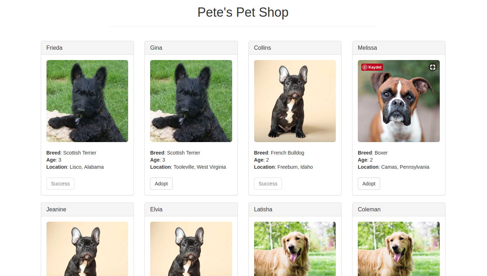

# truffle tutorial

[PetShop](https://truffleframework.com/tutorials/pet-shop) kullanılmıştır.

----

# Kullanılan programlar 

- Git
- Truffle
- Node.js (npm)

# Çalıştırma

- truffle migrate
- npm run dev

  

